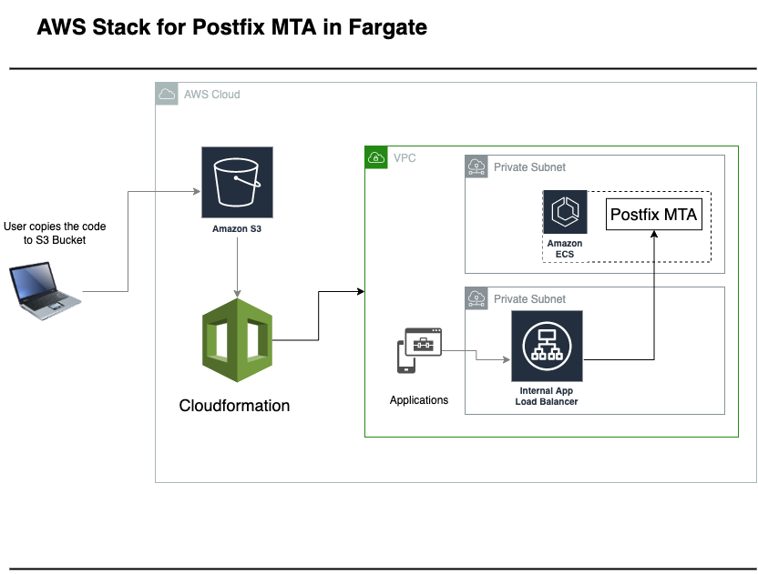

# AWS Postfix Container Stack

A multi-level AWS cloudformation stacks that deploys infrastructure for postfix MTA container instances in AWS Fargate with: 

- three tier vpc 
- a general security group 
- Internal ALB
- Postfix Container instances

## How to Deploy
- To deploy this stack clone this repo and copy it to an S3 bucket preferably a new one
- Once the code is copied to S3 bucket, go to AWS Cloudformation web console and click on Create Stack. 

Only two parameters that are required are: 
- Provide a stack name
- provide the S3 bucket name for the DeploymentBucket parameter where the code is copied 
- email address for the SNS topic which are used for unhealthy host count alarm. 

Rest of the parameters can be left as defaults. Follow the rest of the create stack wizard and it will create a main stack and three nested stacks. 

Once the stacks are successfully deployed, go to Internal ALB nested stack and in the outputs tab check InternalAlbDnsName which can be used to send email. Sample link for emails: 

http://internal-postfix-internal-368740970.ca-central-1.elb.amazonaws.com/

## Cloudformation Stacks: 

### 3tier vpc Stack:
This is [AWS Sample Template](https://github.com/aws-samples/vpc-multi-tier) that will create required VPC and Subnets for the Postfix Fargate instances, internal ALB. [This vpc-multi-tier.yaml](cloudformation-templates/vpc-multi-tier.yaml) stack use all defaults to build the network. 

### Sample Security Group
A generic security group that is being used by containers, ALB and lambda functions (if any). At the moment it allows all traffic between the components.  
#TODO make the SG hardened

### Internal ALB
Creates http internal load balancer that will forward requests to the Postfix MTA agent/container instances through an ECS Service.
To avoid complexity of the stack of SSL certs and domain names, have created http ALB. 

### Postfix ECS Fargate Instances. 
Creates: 
- ECS cluster
- ECS Taskdefination 
- Fargate container instances 
- ECS Service for the tasks and register with the target group

#TODO Considerations: At the moment the containers are created in public subnets with public IP assigned, move it to private subnets. 

### Launch Stack
For readibility/managebility purposes divided components in seperate yaml template files. All these files are then called from [launch-stack.yaml](cloudformation-templates/launch-stack.yaml) that will start creating all the nested cloudformation stacks. All the parameters are pre-populated in the launch stack for an environment. 

## Environemnt Variables (pre populated)
ALLOWED_SENDER_DOMAINS=nqtech.ca

## Issues:
### Healthchecks failing
- need to figure out to fix the healthcheck port. At the moment target group is pointed to smtp 587 which is failing. Maybe need to expose port 80 ( have to do more research).
### Security
- using public container image, should create private repo and only use approved images for production deployments. 
- Improve security group inbound and outbound rules, also every compoenent should have its own security group. 
- go through the sample multi-tier template and check NACL if there ar none create NACLs 
- Convert ALB to HTTPS

### Testing
- create an application to test the emails. 

### Autoscaling
- add autoscaling to the stack. 

# Architecture Diagram

